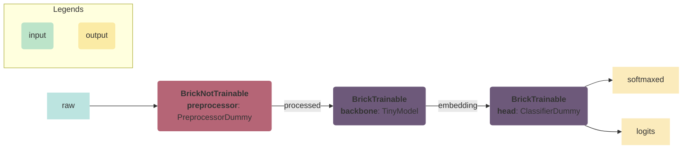
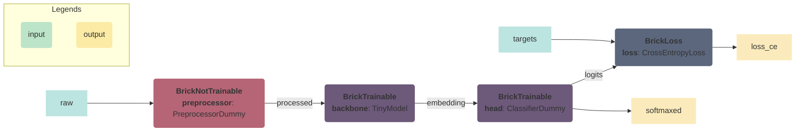
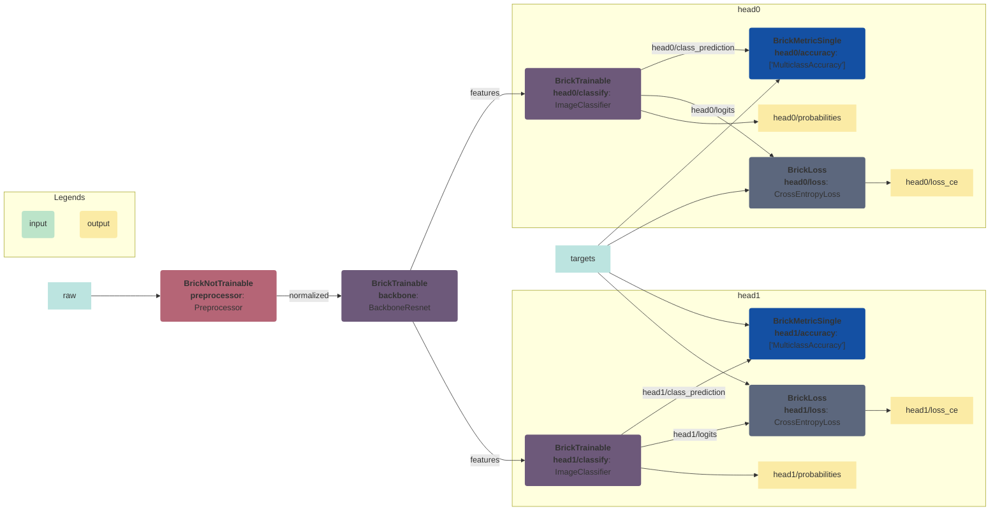

<!--

---
jupyter:
  jupytext:
    hide_notebook_metadata: true
    text_representation:
      extension: .md
      format_name: markdown
      format_version: '1.3'
      jupytext_version: 1.14.5
  kernelspec:
    display_name: torchbricks
    language: python
    name: python3
---

-->

# TorchBricks
[](https://codecov.io/gh/pete-machine/torchbricks)
[](https://github.com/pete-machine/torchbricks/actions/workflows/main.yml)


TorchBricks builds pytorch models using small reuseable and decoupled parts - we call them bricks. 

The concept is simple and flexible and allows you to more easily combine, add or swap out parts of the model 
(preprocessor, backbone, neck, head or post-processor), change the task or extend it with multiple tasks.

TorchBricks also serves as a compact recipe on both how model parts are connected and when parts are executed 
during model stages such as training, validation, testing, inference, export and potentially other stages. 

<!-- #region -->

## Install it with pip

```bash
pip install torchbricks
```
<!-- #endregion -->

## Bricks by example

To demonstrate the the concepts of TorchBricks, we will first specify some dummy parts used of a regular image recognition model: 
A preprocessor, a backbone and a head (in this case a classifier).
*Note: Don't worry about the actually implementation of these modules -they are just dummy examples.*

```python
from typing import Tuple, Any
import torch
from torch import nn
class PreprocessorDummy(nn.Module):
    def forward(self, raw_input: torch.Tensor) -> torch.Tensor:
        return raw_input/2

class TinyModel(nn.Module):
    def __init__(self, n_channels: int, n_features: int) -> None:
        super().__init__()
        self.conv = nn.Conv2d(n_channels, n_features, kernel_size=1)

    def forward(self, tensor: torch.Tensor) -> torch.Tensor:
        return self.conv(tensor)

class ClassifierDummy(nn.Module):
    def __init__(self, num_classes: int, in_features: int) -> None:
        super().__init__()
        self.fc = nn.Linear(in_features, num_classes)
        self.avgpool = nn.AdaptiveAvgPool2d((1, 1))
        self.softmax = nn.Softmax(dim=1)

    def forward(self, tensor: torch.Tensor) -> Tuple[torch.Tensor, torch.Tensor]:
        logits = self.fc(torch.flatten(self.avgpool(tensor), start_dim = 1))
        return logits, self.softmax(logits)
```


## Concept 1: Bricks are connected
An important concept of TorchBricks is that it defines how modules are connected by specifying input and output names of
each module similar to a DAG. 

In below code snippet, we demonstrate how this would look for our dummy model. 

```python
from torchbricks.bricks import BrickCollection, BrickTrainable, BrickNotTrainable, BrickLoss
from torchbricks.bricks import Stage
from torchbricks.graph_plotter import create_mermaid_dag_graph

bricks = {
    'preprocessor': BrickNotTrainable(PreprocessorDummy(), 
                                      input_names=['raw'], 
                                      output_names=['processed']),
    'backbone': BrickTrainable(TinyModel(n_channels=3, n_features=10), 
                               input_names=['processed'], 
                               output_names=['embedding']),
    'head': BrickTrainable(ClassifierDummy(num_classes=3, in_features=10), 
                           input_names=['embedding'], 
                           output_names=['logits', "softmaxed"]),
}
brick_collection = BrickCollection(bricks)
print(brick_collection)
```

Each module is placed in a dictionary with a unique name and wrapped inside a brick with input and output names. 
Input and output names specifies how outputs of one module is passed to inputs of the next module. 

Finally, the dictionary of bricks is passed to a `BrickCollection`. 

Below we visualize how the brick collection connects the different bricks together. 



*Graph is visualized using [mermaid](https://github.com/mermaid-js/mermaid) syntax.*
*We provide the `create_mermaid_dag_graph`-function to create a brick collection visualization*


The `BrickCollection` is used for executing above graph using a dictionary as input.

```python
batch_size=2
batch_images = torch.rand((batch_size, 3, 100, 200))
named_outputs = brick_collection(named_inputs={'raw': batch_images}, stage=Stage.INFERENCE)
print("Brick outputs:", named_outputs.keys())
# Brick outputs: dict_keys(['raw', 'stage', 'processed', 'embedding', 'logits', 'softmaxed'])
```

The brick collection accepts a dictionary and returns a dictionary with all intermediated and resulting tensors. 

Running our models as a brick collection has the following advantages:

- A brick collection act as a regular `nn.Module` with all the familiar features: a `forward`-function, a `to`-function to move 
  to a specific device/precision, you can save/load a model, management of parameters, onnx exportable etc. 
- A brick collection is also a simple DAG, it accepts a dictionary with "named data" (we call this `named_inputs`), 
executes each bricks and ensures that the outputs are passed to the inputs of other bricks with matching names. 
Structuring the model as a DAG, makes it easy to add/remove outputs for a given module during development, add new modules to the
collection and build completely new models from reusable parts. 
- A brick collection is actually a dictionary (`nn.DictModule`). Allowing you to access, pop and update the 
  collection easily as a regular dictionary. It can also handle nested dictionary, allowing groups of bricks to be added/removed easily. 

Note also that we set `stage=Stage.INFERENCE` to explicitly specify if we are doing training, validation, test or inference.
Specifying a stage is important, if we want a module to act in a specific way during a specific stages.

Leading us to the next section


## Concept 2: Bricks can be dead (or alive)
The second concept is to specify when bricks are alive - meaning we specify at which stages (train, test, validation, inference and export) 
a brick is active. 

For other stage the brick will play dead - do nothing / return an empty dictionary. 

Meaning that for different `stages`, we will have the option of creating a unique DAG for each model stage. 

In above example this is not particular interesting - because preprocessor, backbone model and head would typically be alive in all stages. 

So we will demonstrate by adding a loss brick (`BrickLoss`) and specifying `alive_stages` for each brick.

```python
num_classes = 3
bricks = {
    'preprocessor': BrickNotTrainable(PreprocessorDummy(), 
                                      input_names=['raw'], 
                                      output_names=['processed'], 
                                      alive_stages="all"),
    'backbone': BrickTrainable(TinyModel(n_channels=num_classes, n_features=10), 
                               input_names=['processed'], 
                               output_names=['embedding'], 
                               alive_stages="all"),
    'head': BrickTrainable(ClassifierDummy(num_classes=num_classes, in_features=10), 
                           input_names=['embedding'], 
                           output_names=['logits', 'softmaxed'], 
                           alive_stages="all"),
    'loss': BrickLoss(model=nn.CrossEntropyLoss(), 
                      input_names=['logits', 'targets'], 
                      output_names=['loss_ce'], 
                      alive_stages=[Stage.TRAIN, Stage.VALIDATION, Stage.TEST])
}
brick_collection = BrickCollection(bricks)

print(brick_collection)
# BrickCollection(
#   (preprocessor): BrickNotTrainable(PreprocessorDummy, input_names=['raw'], output_names=['processed'], alive_stages=['TRAIN', 'VALIDATION', 'TEST', 'INFERENCE', 'EXPORT'])
#   (backbone): BrickTrainable(TinyModel, input_names=['processed'], output_names=['embedding'], alive_stages=['TRAIN', 'VALIDATION', 'TEST', 'INFERENCE', 'EXPORT'])
#   (head): BrickTrainable(ClassifierDummy, input_names=['embedding'], output_names=['logits', 'softmaxed'], alive_stages=['TRAIN', 'VALIDATION', 'TEST', 'INFERENCE', 'EXPORT'])
#   (loss): BrickLoss(CrossEntropyLoss, input_names=['logits', 'targets'], output_names=['loss_ce'], alive_stages=['TRAIN', 'VALIDATION', 'TEST'])
# )
print(create_mermaid_dag_graph(brick_collection))
```

We set `preprocessor`, `backbone` and `head` to be alive on all stages `alive_stages="all"` - this is the default behavior and
similar to before. 
 
For `loss` we set `alive_stages=[Stage.TRAIN, Stage.VALIDATION, Stage.TEST]` to only calculate loss during train, validation and test
stages. 


**Graph during inference and export:**
During `Stage.INFERENCE` and `Stage.EXPORT`, the loss modules is dead and note only `raw` is required as input:


**Graph during train, test and validation:**

During `Stage.TRAIN`, `Stage.VALIDATION` and `Stage.TEST`, the loss module is alive and note both `raw` and `targets` are required as inputs:





## Bricks for model training
**We are not creating a training framework**, but to easily use the brick collection in your favorite training framework or custom 
training/validation/test loop, we need the final piece: **Calculating model metrics** 

To easily inject both model, losses and metrics, we also need to easily support metrics and calculate metrics across a dataset. 
We will extend our example from before by adding metric bricks. 

To calculate metrics across a dataset, we heavily rely on concepts and functions used in the 
[TorchMetrics](https://torchmetrics.readthedocs.io/en/stable/) library.

The used of TorchMetrics in a brick collection is demonstrated in below code snippet. 

```python
import torchvision
from torchbricks.bag_of_bricks import ImageClassifier, Preprocessor, resnet_to_brick
from torchbricks.bricks import BrickMetricSingle
from torchmetrics.classification import MulticlassAccuracy

num_classes = 10
resnet = torchvision.models.resnet18(weights=None, num_classes=num_classes)
resnet_brick = resnet_to_brick(resnet=resnet,  input_name='normalized', output_name='features')
n_features = resnet_brick.model.n_backbone_features
bricks = {
    'preprocessor': BrickNotTrainable(Preprocessor(), 
                                      input_names=['raw'], 
                                      output_names=['normalized']),
    'backbone': resnet_brick,
    'head': BrickTrainable(ImageClassifier(num_classes=num_classes, n_features=n_features),
                           input_names=['features'], 
                           output_names=['logits', 'probabilities', 'class_prediction']),
    'accuracy': BrickMetricSingle(MulticlassAccuracy(num_classes=num_classes), 
                                  input_names=['class_prediction', 'targets']),
    'loss': BrickLoss(model=nn.CrossEntropyLoss(), 
                      input_names=['logits', 'targets'], 
                      output_names=['loss_ce'])
}
brick_collection = BrickCollection(bricks)
```

We will now use the brick collection above to simulate how a user can iterate over a dataset and 
calling the brick for each batch 

```python
for i_batch in range(5): # Simulates iterating over the dataset
    named_inputs = {"raw": batch_images, "targets": torch.ones((batch_size), dtype=torch.int64)}
    named_outputs = brick_collection(named_inputs=named_inputs, stage=Stage.TRAIN)

metrics = brick_collection.summarize(stage=Stage.TRAIN, reset=True)
print(f"{metrics=}, {named_outputs.keys()=}")
```

For each iteration in our (simulated) dataset, we calculate model outputs, losses and metrics for each batch. 
Unlike other bricks, `BrickMetrics` will not (by default) output metrics for each batch. 
Instead metrics are stored internally in `BrickMetricSingle` and only aggregated and return when
the `summarize` function is called. In above example the aggregated metric over over 5 batches.

It is important to note that we set `reset=True` to reset the internal aggregation of metrics.  

**Additional notes on metrics**

You have the option of either using a single metric (`torchmetrics.Metric`) with `BrickMetricSingle` or a collection of 
metrics (`torchmetrics.MetricCollection`) with `BrickMetrics`.

For multiple metrics, we advice to use `BrickMetrics` with a `torchmetrics.MetricCollection` 
[doc](https://torchmetrics.readthedocs.io/en/stable/pages/overview.html#metriccollection). 
It has some intelligent mechanisms for efficiently sharing calculation for multiple metrics.

Note also that metrics are not passed to other bricks or returned as output of the brick collection - they are only stored internally. 
To also pass metrics to other bricks, you can set `return_metrics=True` for `BrickMetrics` and `BrickMetricSingle`. 
But be aware, this will add computational cost. 


## Bricks motivation (to be continued)

The main motivation:
- 
- Each brick can return whatever - they are not forced to only returning e.g. logits... If you want the model backbone embeddings
  you can do that to. 
- Avoid modules within modules within modules to created models that are combined. 
- Not flexible. It is possible to make the first encode/decode model... But adding a preprocessor, swapping out a backbone,
  adding additional heads or necks and sharing computations will typically not be easy. I ended up creating multiple modules that are
  called within other modules... All head/modules pass dictionaries between modules. 
- Typically not very reusable. 
- By packing model modules, metrics and loss-functions into a brick collection, we can more easily 
inject any desired brick collection into your custom trainer without doing modifications to the trainer.

Including metrics and losses with the model. 
- Model, metrics and losses are connected. If we want to add an additional head to a model - we should also add losses and metrics. 
- The typical distinction between `encode`  / `decoder` becomes to limited... Multiple decoders might share a `neck`.


## Brick features: 


### Brick features: Export as ONNX
To export a brick collection as onnx we provide the `export_bricks_as_onnx`-function. 

Pass an example input (`named_input`) to trace a brick collection.
Set `dynamic_batch_size=True` to support any batch size inputs and here we explicitly set `stage=Stage.EXPORT` - this is also 
the default.

```python
from pathlib import Path
from torchbricks.brick_utils import export_bricks_as_onnx
path_build = Path("build")
path_build.mkdir(exist_ok=True)
path_onnx = path_build / "readme_model.onnx"

export_bricks_as_onnx(path_onnx=path_onnx, 
                      brick_collection=brick_collection, 
                      named_inputs=named_inputs, 
                      dynamic_batch_size=True, 
                      stage=Stage.EXPORT)
```

### Brick features: Act as a nn.Module
A brick collection acts as a 'nn.Module' meaning:

```python
# Move to specify device (CPU/GPU) or precision to automatically move model parameters
brick_collection.to(torch.float16)
brick_collection.to(torch.float32)

# Save model parameters
path_model = Path("build/readme_model.pt")
torch.save(brick_collection.state_dict(), path_model)

# Load model parameters
brick_collection.load_state_dict(torch.load(path_model))

# Access parameters
brick_collection.named_parameters()

# Using compile with pytorch >= 2.0
torch.compile(brick_collection)
```

### Brick features: Nested bricks and relative input/output names
To more easily add, remove and swap out a subset of bricks in a brick collection (e.g. bricks related to specific task), we
support passing a nested dictionary of bricks to a `BrickCollection` and using relative input and output names. 

Both nested dictionaries and relative input and output names are demonstrated below by adding multiple classifications 
heads (`head0` and `head1`) to a brick collection. Each classification head is created with `create_image_classification_head`. 

Note also that the function uses relative names such as `./logits`, `./probabilities`, `./class_prediction` and `./loss_ce`. 
Relative names will use the brick name to derive "absolute" names. E.g. for `head0` the relative input name `./logits` 
becomes `head0/logits` and for `head1` the relative input name `./logits`  becomes `head1/logits`

```python
from typing import Dict

from torchbricks.bricks import BrickInterface


def create_image_classification_head(num_classes: int, in_channels: int, features_name: str, targets_name: str) -> Dict[str, BrickInterface]:
    """Image classifier bricks: Classifier, loss and metrics """
    head = {
        'classify': BrickTrainable(ImageClassifier(num_classes=num_classes, n_features=in_channels),
                                   input_names=[features_name], 
                                   output_names=['./logits', './probabilities', './class_prediction']),
        'accuracy': BrickMetricSingle(MulticlassAccuracy(num_classes=num_classes), 
                                      input_names=['./class_prediction', targets_name]),
        'loss': BrickLoss(model=nn.CrossEntropyLoss(),
                          input_names=['./logits', targets_name], 
                          output_names=['./loss_ce'])
    }
    return head

n_features = resnet_brick.model.n_backbone_features
bricks = {
    'preprocessor': BrickNotTrainable(Preprocessor(), 
                                      input_names=['raw'], 
                                      output_names=['normalized']),
    'backbone': resnet_brick,
    'head0': create_image_classification_head(num_classes=3, in_channels=n_features, features_name='features', targets_name='targets'),
    'head1': create_image_classification_head(num_classes=5, in_channels=n_features, features_name='features', targets_name='targets'),
}
brick_collections = BrickCollection(bricks)
print(brick_collections)
print(create_mermaid_dag_graph(brick_collections))
```

Mermaid visualization of above graph: 



### Brick features: Bag of bricks - reusable bricks modules
Note also in above example we use bag-of-bricks to import commonly used `nn.Module`s 

This includes a `Preprocessor`, `ImageClassifier` and `resnet_to_brick` to convert a torchvision resnet models to a backbone brick 
without a classifier.


### Brick features: Training with pytorch-lightning trainer
I like and love pytorch-lightning! We can avoid writing the easy-to-get-wrong training loop and validation/test scrips.

Pytorch lightning creates logs, ensures training is done efficiently on any device (CPU, GPU, TPU), on multiple/distributed devices 
with reduced precision and much more.

However, one issue I found myself having when wanting to extend my custom pytorch-lightning module (`LightningModule`) is that it forces an
object oriented style with multiple levels of inheritance. This is not necessarily bad, but it makes it hard to reuse 
code across projects and generally makes the code complicated. 

With a brick collection you should rarely change or inherit your lightning module, instead you can inject the model, metrics and loss functions
into a lightning module. Changes to preprocessor, backbone, necks, heads, metrics and losses are done on the outside
and injected into the lightning module. 

Below is an example of how you could inject a brick collection with pytorch-lightning. 

We have created `LightningBrickCollection` ([available here](https://github.com/PeteHeine/torchbricks/blob/main/scripts/lightning_module.py)) 
as an example for you to use. 


```python
from functools import partial
from pathlib import Path

import torchvision
import pytorch_lightning as pl
from utils_testing.lightning_module import LightningBrickCollection
from utils_testing.datamodule_cifar10 import CIFAR10DataModule

experiment_name="CIFAR10"
transform = torchvision.transforms.ToTensor()
data_module = CIFAR10DataModule(data_dir='data', batch_size=5, num_workers=12, test_transforms=transform, train_transforms=transform)
create_opimtizer_func = partial(torch.optim.SGD, lr=0.05, momentum=0.9, weight_decay=5e-4)
bricks_lightning_module = LightningBrickCollection(path_experiments=Path("build") / "experiments",
                                                   experiment_name=None,
                                                   brick_collection=brick_collection,
                                                   create_optimizers_func=create_opimtizer_func)

trainer = pl.Trainer(max_epochs=1, limit_train_batches=2, limit_val_batches=2, limit_test_batches=2)
# Train and test model by injecting 'bricks_lightning_module'
# trainer.fit(bricks_lightning_module, datamodule=data_module)
# trainer.test(bricks_lightning_module, datamodule=data_module)
```


### Brick features: Pass all intermediate tensors to Brick
By adding `'__all__'` to `input_names`, it is possible to access all tensors as a dictionary inside a brick module. 
For production code, this may not be the best option, but this feature can be valuable during an exploration phase or 
when doing some live debugging of a new model/module. 

We will demonstrate in code by introducing a (dummy) module `VisualizeRawAndPreprocessed`.

*Note: It is just a dummy class, don't worry to much about the actual implementation.*

The important thing to notice is that `input_names = ['__all__']` is used for our `visualizer`-brick to
pass all tensors as a dictionary as an argument in the forward call. 

```python
class VisualizeRawAndPreprocessed(torch.nn.Module):
    def forward(self, named_inputs: Dict[str, Any]):
        ## Here `named_inputs` contains all intermediate tensors
        image_raw_and_preprocessed = torch.concatenate((named_inputs["raw"], named_inputs["preprocessed"]), dim=3)
        return image_raw_and_preprocessed


bricks = {
    'preprocessor': BrickNotTrainable(PreprocessorDummy(), input_names=['raw'],  output_names=['preprocessed']),
    'backbone': BrickTrainable(TinyModel(n_channels=3, n_features=10), input_names=['preprocessed'], output_names=['embedding']),
    'visualizer': BrickNotTrainable(VisualizeRawAndPreprocessed(), input_names = ['__all__'], output_names=["visualization"])
}
brick_collection = BrickCollection(bricks)
named_outputs = brick_collection(named_inputs={'raw': torch.rand((2, 3, 100, 200))}, stage=Stage.INFERENCE)
```

### Brick features: Using Stage Inside Module
By passing in `stage` in `input_names` it is possible to change the program flow. 

As demonstrated below want to alway resize the input to a specific size when the model is being exported.

```python
class Preprocessor(torch.nn.Module):
    def forward(self, input_image: torch.Tensor, stage: Stage) -> str:
        if stage in [Stage.EXPORT]:
            input_image = torch.nn.functional.interpolate(input_image, size=(50,100))
        return input_image/2


brick_collection = BrickCollection({
        "preprocessor": BrickNotTrainable(Preprocessor(), input_names=['raw', 'stage'], output_names=["processed"])
    })
named_inputs = {'raw': torch.rand((2, 3, 100, 200))}
named_outputs = brick_collection(named_inputs=named_inputs, stage=Stage.EXPORT)
assert list(named_outputs["processed"].shape[2:]) == [50, 100]

named_outputs = brick_collection(named_inputs=named_inputs, stage=Stage.VALIDATION)
assert list(named_outputs["processed"].shape[2:]) == [100, 200]
```

### Brick features: Visualizations in TorchBricks
We provide `BrickPerImageProcessing` as base brick for doing visualizations in a brick collection. 
The advantage of brick-based visualization is that it can be bundled together with a specific task/head. 

The challenge that `BrickPerImageProcessing` tries addresses is that drawing and visualization functions typically 
operate on per image basis and operates on non-`torch.Tensor` data types. 
E.g. Opencv uses `np.array` and pillow using `Image`. 

The goal of `BrickPerImageProcessing` is to convert batched tensors/data to per image data in desired type
and pass it to a draw function. Look up the documentation of `BrickPerImageProcessing` to see all options.

Below we will show how it may use pillow draw functions: 


```python

from PIL import Image, ImageDraw, ImageFont
from torchbricks.brick_visualizer import BrickPerImageProcessing
from torchbricks.tensor_operations import unpack_batched_tensor_to_pillow_image


def draw_image_classification(input_image: Image.Image, target_name: str) -> Image.Image:
    """Draws image classification results"""
    draw = ImageDraw.Draw(input_image) 
    font = ImageFont.truetype('tests/data/font_ASMAN.TTF', 50) 
    draw.text((25, 25), text=target_name, font = font, align ="left") 
    return input_image


class BrickDrawImageClassification(BrickPerImageProcessing):
    def __init__(self, input_image: str, target_name: str, output_name: str):
        super().__init__(callable=draw_image_classification, input_names=[input_image, target_name], output_names=[output_name],
                         input_name_unpack_functions={input_image: unpack_batched_tensor_to_pillow_image})


bricks = {
    'visualizer': BrickDrawImageClassification(input_image="input_image", target_name="target", output_name="visualization")
}

batched_inputs = {'input_image': torch.zeros((2, 3, 100, 200)), 'target': ['cat', 'dog']}
brick_collection = BrickCollection(bricks)
outputs = brick_collection(named_inputs=batched_inputs, stage=Stage.INFERENCE)

display(outputs["visualization"][0],  outputs["visualization"][1])
```


## Why should I explicitly set the train, val or test stage

MISSING


<!-- #region -->
##

## What are we missing?


- [x] ~~Proper~~ Added a link to `LightningBrickCollection` for other people to use
- [x] Minor: BrickCollections supports passing a dictionary with BrickCollections. But we should also convert a nested dictionary into a nested brick collections
- [x] Minor: Currently, `input_names` and `output_names` support positional arguments, but we should also support keyword arguments.
- [x] Minor: Make Brick an abstract class
- [x] Convert torchvision resnet models to only a backbone brick.
- [x] Make readme a notebook
- [x] Automatically convert jupyter notebook to `README.md`
- [x] Remove README.md header
- [x] Make an export to onnx function 
- [x] Make it optional if gradients can be passed through NonTrainableBrick without weights being optimized
- [x] Refactor Metrics: Create BrickMetricCollection and BrickSingleMetric and create flag to return metrics.
- [x] Make brick base class with input_names, output_names and alive_stages - inherit this from other bricks. 
  - Pros: We might include other non-torch modules later. 
  - Do not necessarily pass a stage-object. Consider also passing it as a string so it can be handled correctly with scripting. 
- [x] Update README.md to match the new bricks. 
  - [x] Start with basic bricks example. 
  - [x] Use loss-function to show that stage decided on what is being executed. 
  - [x] Introduce metrics by it-self in another example
- [x] Ensure that all examples in the `README.md` are working with easy to use modules. 
- [x] Add typeguard
- [x] Allow a brick to receive all named_inputs and add a test for it.
- [x] Fix the release process. It should be as simple as running `make release`.
- [x] Add onnx export example to the README.md
- [x] Pretty print bricks
- [x] Relative input/output names
- [x] Test to verify that environment matches conda lock. The make command 'update-lock-file' should store a copy of 'environment.yml'
      We will the have a test checking if the copy and the current version of `environment.yml` is the same.
- [x] Add code coverage and tests passed badges to readme again
- [x] Create brick-collection visualization tool ("mermaid?")
- [x] Make DAG like functionality to check if a inputs and outputs works for all model stages.
- [ ] Make common Visualizations with pillow - not opencv to not blow up the required dependencies. ImageClassification, Segmentation, ObjectDetection
  - [ ] Maybe visualizations should be done in OpenCV it is faster. 
  - [ ] VideoModule to store data as a video
  - [ ] DisplayModule to show data
- [ ] Multiple named tensors caching module. 
- [ ] Use pymy, pyright or pyre to do static code checks. 
- [ ] Decide: Add stage as an internal state and not in the forward pass:
  - Minor Pros: Tracing (to get onnx model) requires only torch.Tensors only as input - we avoid making an adapter class. 
  - Minor Cons: State gets hidden away - implicit instead of explicit.
  - Minor Pros: Similar to eval/training 
- [ ] Collection of helper modules. Preprocessors, Backbones, Necks/Upsamplers, ImageClassification, SemanticSegmentation, ObjectDetection
  - [ ] All the modules in the README should be easy to import as actually modules.
  - [ ] Make common brick collections: BricksImageClassification, BricksSegmentation, BricksPointDetection, BricksObjectDetection
- [ ] Support preparing data in the dataloader?
- [ ] Support torch.jit.scripting? 

## How does it really work?
????


## Development

Read the [CONTRIBUTING.md](CONTRIBUTING.md) file.

### Install

    conda create --name torchbricks --file conda-linux-64.lock
    conda activate torchbricks
    poetry install

### Activating the environment

    conda activate torchbricks

<!-- #endregion -->


