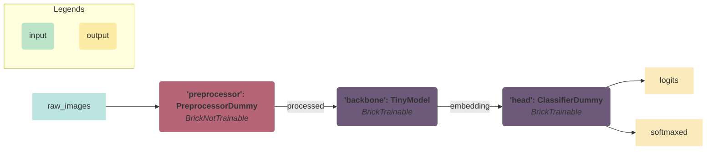
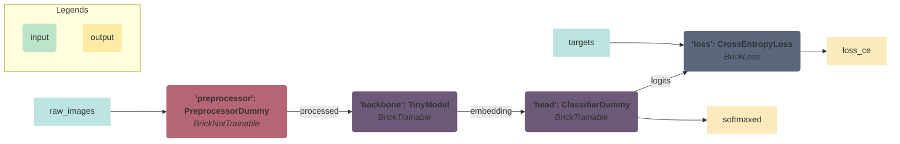
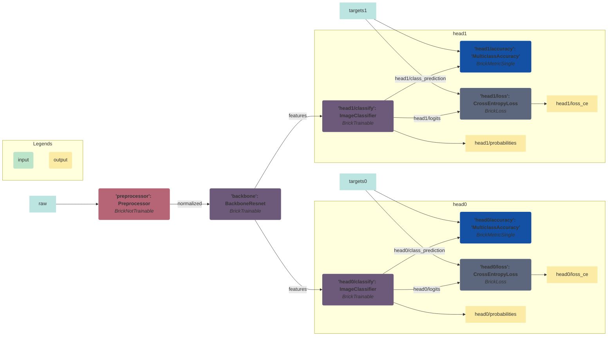

<!--

---
jupyter:
  jupytext:
    hide_notebook_metadata: true
    text_representation:
      extension: .md
      format_name: markdown
      format_version: '1.3'
      jupytext_version: 1.14.5
  kernelspec:
    display_name: torchbricks
    language: python
    name: python3
---

-->

# TorchBricks
[](https://codecov.io/gh/pete-machine/torchbricks)
[](https://github.com/pete-machine/torchbricks/actions/workflows/main.yml)


TorchBricks builds pytorch models using small reuseable and decoupled parts - we call them bricks. 

The concept is simple and flexible and allows you to more easily combine, add or swap out parts of the model 
(preprocessor, backbone, neck, head or post-processor), change the task or extend it with multiple tasks.

TorchBricks is a compact recipe on both *how* model parts are connected and *when* parts are executed 
during model stages such as training, validation, testing, inference and export.

<!-- #region -->

## Install it with pip

```bash
pip install torchbricks
```
<!-- #endregion -->

## Bricks by example

To demonstrate the the concepts of TorchBricks, we will first specify some dummy parts used in a regular image recognition model: 
A preprocessor, a backbone and a head (in this case a classifier).
*Note: Don't worry about the actually implementation of these modules - they are just dummy examples.*

```python
from typing import Tuple

import torch
from torch import nn


class PreprocessorDummy(nn.Module):
    def forward(self, raw_input: torch.Tensor) -> torch.Tensor:
        return raw_input / 2


class TinyModel(nn.Module):
    def __init__(self, n_channels: int, n_features: int) -> None:
        super().__init__()
        self.conv = nn.Conv2d(n_channels, n_features, kernel_size=1)

    def forward(self, tensor: torch.Tensor) -> torch.Tensor:
        return self.conv(tensor)


class ClassifierDummy(nn.Module):
    def __init__(self, num_classes: int, in_features: int) -> None:
        super().__init__()
        self.fc = nn.Linear(in_features, num_classes)
        self.avgpool = nn.AdaptiveAvgPool2d((1, 1))
        self.softmax = nn.Softmax(dim=1)

    def forward(self, tensor: torch.Tensor) -> Tuple[torch.Tensor, torch.Tensor]:
        logits = self.fc(torch.flatten(self.avgpool(tensor), start_dim=1))
        return logits, self.softmax(logits)
```


## Concept 1: Bricks are connected
An important concept of TorchBricks is that it defines how modules are connected by specifying input and output names of
each module similar to a DAG. 

In below code snippet, we demonstrate how this would look for our dummy model. 

```python
from torchbricks.bricks import BrickCollection, BrickNotTrainable, BrickTrainable

bricks = {
    "preprocessor": BrickNotTrainable(PreprocessorDummy(), input_names=["raw_images"], output_names=["processed"]),
    "backbone": BrickTrainable(TinyModel(n_channels=3, n_features=10), input_names=["processed"], output_names=["embedding"]),
    "head": BrickTrainable(ClassifierDummy(num_classes=3, in_features=10), input_names=["embedding"], output_names=["logits", "softmaxed"]),
}
brick_collection = BrickCollection(bricks)
# print(create_mermaid_dag_graph(brick_collection))
print(brick_collection)
```

Each module is placed in a dictionary with a unique name and wrapped inside a brick with input and output names. 
Input and output names specifies how outputs of one module is passed to inputs of the next module. 

In above example, we use `BrickNotTrainable` to wrap modules that are shouldn't be trained (weights are fixed) and 
`BrickTrainable` to wrap modules that are trainable (weights are updated on each training iteration). 

Finally, the dictionary of bricks is passed to a `BrickCollection`. 

Below we visualize how the brick collection connects bricks together. 



*Graph is visualized using [mermaid](https://github.com/mermaid-js/mermaid) syntax.*
*We provide the `create_mermaid_dag_graph`-function to create a brick collection visualization*


The `BrickCollection` is used for executing above graph by passing a dictionary with named input data (`named_inputs`). 

For above brick collection, we only expect one named input called `raw_images`. 

```python
batch_size = 2
batched_images = torch.rand((batch_size, 3, 100, 200))
named_inputs = {"raw_images": batched_images}
named_outputs = brick_collection(named_inputs=named_inputs)
print("Brick outputs:", named_outputs.keys())
# Brick outputs: dict_keys(['raw_images', 'processed', 'embedding', 'logits', 'softmaxed'])
```

The brick collection accepts a dictionary and returns a dictionary with all intermediated and resulting tensors. 

Running our models as a brick collection has the following advantages:

- A brick collection act as a regular `nn.Module` with all the familiar features: a `forward`-function, a `to`-function to move 
  to a specific device/precision, you can save/load a model, management of parameters, onnx exportable etc. 
- A brick collection is also a simple DAG, it accepts a dictionary with "named data" (we call this `named_inputs`), 
executes each bricks and ensures that the outputs are passed to the inputs of other bricks with matching names. 
Structuring the model as a DAG, makes it easy to add/remove outputs for a given module during development, add new modules to the
collection and build completely new models from reusable parts. 
- A brick collection is actually a dictionary (`nn.DictModule`). Allowing you to access, pop and update the 
  collection easily as a regular dictionary. It can also handle nested dictionary, allowing groups of bricks to be added/removed easily. 


## Concept 2: Bricks are grouped
The second concept is that each brick is grouped by specifying a group name for each brick. 

To demonstrate why this is useful, we introduce multiple other bricks; `BrickLoss`, `BrickMetric` and ``

```python
from torchbricks.bricks import BrickLoss
from torchbricks.graph_plotter import create_mermaid_dag_graph

num_classes = 3
bricks = {
    "preprocessor": BrickNotTrainable(PreprocessorDummy(), input_names=["raw_images"], output_names=["processed"], group="MODEL"),
    "backbone": BrickTrainable(
        TinyModel(n_channels=num_classes, n_features=10), input_names=["processed"], output_names=["embedding"], group="MODEL"
    ),
    "head": BrickTrainable(
        ClassifierDummy(num_classes=num_classes, in_features=10),
        input_names=["embedding"],
        output_names=["logits", "softmaxed"],
        group="MODEL",
    ),
    "loss": BrickLoss(model=nn.CrossEntropyLoss(), input_names=["logits", "targets"], output_names=["loss_ce"], group="LOSS"),
}
brick_collection = BrickCollection(bricks)

print(brick_collection)
# BrickCollection(
#   (preprocessor): BrickNotTrainable(PreprocessorDummy, input_names=['raw_images'], output_names=['processed'], groups={'MODEL'})
#   (backbone): BrickTrainable(TinyModel, input_names=['processed'], output_names=['embedding'], groups={'MODEL'})
#   (head): BrickTrainable(ClassifierDummy, input_names=['embedding'], output_names=['logits', 'softmaxed'], groups={'MODEL'})
#   (loss): BrickLoss(CrossEntropyLoss, input_names=['logits', 'targets'], output_names=['loss_ce'], groups={'LOSS'})
# )
print(create_mermaid_dag_graph(brick_collection))
```

We set `preprocessor`, `backbone` and `head` to be alive on all stages `alive_stages="all"` - this is the default behavior and
similar to before. 
 
For `loss` we set `alive_stages=[Stage.TRAIN, Stage.VALIDATION, Stage.TEST]` to only calculate loss during train, validation and test
stages. 


**Graph during train, test and validation:**

During `Stage.TRAIN`, `Stage.VALIDATION` and `Stage.TEST`, the loss module is alive and note now that 
both `raw_images` and `targets` are required as inputs:





**Graph during inference and export:**

During `Stage.INFERENCE` and `Stage.EXPORT`, the graph will look as before, the loss modules is dead and note that `raw_images` is 
the only required input


As demonstrated in above example, we can easily change the required inputs by change the model stage.
That allows us to support two basic use cases:

1) When labels/targets are available, we have the option of getting model prediction along with loss and metrics.

2) When labels/targets are **not** available, we do only model predictions used for model inference/export.

The mechanism of activating different parts of the model and making loss, metrics and visualizations part of the model recipe, 
allows us to more easily investigate/debug/visualize model parts in a notebook or scratch scripts.


## Brick features: 


### Brick feature: TorchMetrics
**We are not creating a training framework**, but to easily use the brick collection in your favorite training framework or custom 
training/validation/test loop, we need the option of **calculating model metrics** 

To easily inject both model, losses and metrics, we also need to easily support metrics and calculate metrics across a dataset. 
We will extend our example from before by adding metric bricks. 

To calculate metrics across a dataset, we heavily rely on concepts and functions used in the 
[TorchMetrics](https://torchmetrics.readthedocs.io/en/stable/) library.

The used of TorchMetrics in a brick collection is demonstrated in below code snippet. 

```python
import torchvision
from torchbricks.bag_of_bricks.backbones import resnet_to_brick
from torchbricks.bag_of_bricks.image_classification import ImageClassifier
from torchbricks.bag_of_bricks.preprocessors import Preprocessor
from torchbricks.bricks import BrickLoss, BrickMetricSingle
from torchmetrics.classification import MulticlassAccuracy

num_classes = 10
resnet = torchvision.models.resnet18(weights=None, num_classes=num_classes)
resnet_brick = resnet_to_brick(resnet=resnet, input_name="normalized", output_name="features")
n_features = resnet_brick.model.n_backbone_features
bricks = {
    "preprocessor": BrickNotTrainable(Preprocessor(), input_names=["raw"], output_names=["normalized"]),
    "backbone": resnet_brick,
    "head": BrickTrainable(
        ImageClassifier(num_classes=num_classes, n_features=n_features),
        input_names=["features"],
        output_names=["logits", "probabilities", "class_prediction"],
    ),
    "accuracy": BrickMetricSingle(MulticlassAccuracy(num_classes=num_classes), input_names=["class_prediction", "targets"]),
    "loss": BrickLoss(model=nn.CrossEntropyLoss(), input_names=["logits", "targets"], output_names=["loss_ce"]),
}
brick_collection = BrickCollection(bricks)
```

We will now use the brick collection above to simulate how a user can iterate over a dataset.

```python
# Simulate dataloader
named_input_simulated = {"raw": batched_images, "targets": torch.ones((batch_size), dtype=torch.int64)}
dataloader_simulated = [named_input_simulated for _ in range(5)]

# Loop over the dataset
for named_inputs in dataloader_simulated:  # Simulates iterating over the dataset
    named_outputs = brick_collection(named_inputs=named_inputs)
    named_outputs_losses_only = brick_collection.extract_losses(named_outputs=named_outputs)

metrics = brick_collection.summarize(reset=True)
print(f"{named_outputs.keys()=}")
# named_outputs.keys()=dict_keys(['raw', 'targets', 'stage', 'normalized', 'features', 'logits', 'probabilities', 'class_prediction', 'loss_ce'])
print(f"{metrics=}")
# metrics={'MulticlassAccuracy': tensor(0.)}
```

For each iteration in our (simulated) dataset, we calculate model outputs, losses and metrics for each batch. 

Losses are calculated and returned in `named_outputs` together with other model outputs. 
We provide `extract_losses` as simple function to filter `named_outputs` and only return losses in a new dictionary. 

Unlike other bricks, `BrickMetrics` will not (by default) output metrics for each batch. 
Instead metrics are stored internally in `BrickMetricSingle` and only aggregated and return when
the `summarize` function is called. In above example, metric is aggregated over 5 batches as summaries to a single value. 

It is important to note that we set `reset=True` to reset the internal aggregation of metrics.  

**Additional notes on metrics**

You have the option of either using a single metric (`torchmetrics.Metric`) with `BrickMetricSingle` or a collection of 
metrics (`torchmetrics.MetricCollection`) with `BrickMetrics`.

For multiple metrics, we advice to use `BrickMetrics` with a `torchmetrics.MetricCollection` 
[doc](https://torchmetrics.readthedocs.io/en/stable/pages/overview.html#metriccollection). 
It has some intelligent mechanisms for efficiently sharing calculation for multiple metrics.

Note also that metrics are not passed to other bricks or returned as output of the brick collection - they are only stored internally. 
To also pass metrics to other bricks, you can set `return_metrics=True` for `BrickMetrics` and `BrickMetricSingle`. 
But be aware, this will add computational cost. 


### Brick features: Act as a nn.Module
A brick collection acts as a 'nn.Module' meaning:

```python
from pathlib import Path

# Move to specify device (CPU/GPU) or precision to automatically move model parameters
brick_collection.to(torch.float16)
brick_collection.to(torch.float32)

# Save model parameters
path_model = Path("build/readme_model.pt")
torch.save(brick_collection.state_dict(), path_model)

# Load model parameters
brick_collection.load_state_dict(torch.load(path_model))

# Iterate all parameters
for name, params in brick_collection.named_parameters():
    pass

# Iterate all layers
for name, module in brick_collection.named_modules():
    pass

# Using compile with pytorch >= 2.0
torch.compile(brick_collection)
```

### Brick features: Nested bricks and relative input/output names
To more easily add, remove and swap out a subset of bricks in a brick collection (e.g. bricks related to specific task), we
support passing a nested dictionary of bricks to a `BrickCollection` and using relative input and output names. 

First we create a function (`create_image_classification_head`) that returns a dictionary with image classification specific 
bricks. 

```python
from typing import Dict

from torchbricks.bricks import BrickInterface


def create_image_classification_head(
    num_classes: int, in_channels: int, features_name: str, targets_name: str
) -> Dict[str, BrickInterface]:
    """Image classifier bricks: Classifier, loss and metrics"""
    head = {
        "classify": BrickTrainable(
            ImageClassifier(num_classes=num_classes, n_features=in_channels),
            input_names=[features_name],
            output_names=["./logits", "./probabilities", "./class_prediction"],
        ),
        "accuracy": BrickMetricSingle(MulticlassAccuracy(num_classes=num_classes), input_names=["./class_prediction", targets_name]),
        "loss": BrickLoss(model=nn.CrossEntropyLoss(), input_names=["./logits", targets_name], output_names=["./loss_ce"]),
    }
    return head
```

We now create the full model containing a `preprocessor`, `backbone` and two independent heads called `head0` and `head1`.
Each head is a dictionary of bricks, making our brick collection a nested dictionary. 

```python
n_features = resnet_brick.model.n_backbone_features
bricks = {
    "preprocessor": BrickNotTrainable(Preprocessor(), input_names=["raw"], output_names=["normalized"]),
    "backbone": resnet_brick,
    "head0": create_image_classification_head(num_classes=3, in_channels=n_features, features_name="features", targets_name="targets0"),
    "head1": create_image_classification_head(num_classes=5, in_channels=n_features, features_name="features", targets_name="targets1"),
}
brick_collections = BrickCollection(bricks)
print(brick_collections)
print(create_mermaid_dag_graph(brick_collections))
```

Also demonstrated in above example is the use of relative input and output names. 
Looking at our `create_image_classification_head` function again, you will notice that we actually use of relative input and output names 
(`./logits`, `./probabilities`, `./class_prediction` and `./loss_ce`). 

Relative names will use the brick name to derive "absolute" names. E.g. for `head0` the relative 
input name `./logits` becomes `head0/logits` and for `head1` the relative input name `./logits`  becomes `head1/logits`.

We visualize above graph: 





### Brick features: Save and loading bricks
A brick collection can be saved and loaded as a regular pytorch `nn.Module`. For more information you can look up the official 
pytorch guide on [Saving and Loading Models](https://pytorch.org/tutorials/beginner/saving_loading_models.html). 

However, we have also added a brick collection specific saving/loading format. It uses a pytorch weight format, 
but creates a model file for each brick and keeps files in a nested folder structure. 

The idea is that a user can more easily add or remove weights to a specific model by simply moving around model files and folders.
Time will tell, if this a useful abstraction or dead code. 

But it looks like this: 

```python
path_model_folder = Path("build/bricks")

# Saving model parameters brick-collection style
brick_collections.save_bricks(path_model_folder=path_model_folder, exist_ok=True)

print("Model files: ")
print("\n".join(str(path) for path in path_model_folder.rglob("*.pt")))

# Loading model parameters brick-collection style
brick_collection.load_bricks(path_model_folder=path_model_folder)
```

### Brick features: Export as ONNX
To export a brick collection as onnx we provide the `export_bricks_as_onnx`-function. 

Pass an example input (`named_input`) to trace a brick collection.
Set `dynamic_batch_size=True` to support any batch size inputs and here we explicitly set `stage=Stage.EXPORT` - this is also 
the default.

```python
from torchbricks.brick_utils import export_bricks_as_onnx

path_build = Path("build")
path_build.mkdir(exist_ok=True)
path_onnx = path_build / "readme_model.onnx"

export_bricks_as_onnx(path_onnx=path_onnx, brick_collection=brick_collection, named_inputs=named_inputs, dynamic_batch_size=True)
```

### Brick features: Bag of bricks - reusable bricks modules
Note also in above example we use bag-of-bricks to import commonly used `nn.Module`s 

This includes a `Preprocessor`, `ImageClassifier` and `resnet_to_brick` to convert a torchvision resnet models to a backbone brick 
without a classifier.


### Brick features: Training with pytorch-lightning trainer
I like and love pytorch-lightning! We can avoid writing the easy-to-get-wrong training loop and validation/test scrips.

Pytorch lightning creates logs, ensures training is done efficiently on any device (CPU, GPU, TPU), on multiple/distributed devices 
with reduced precision and much more.

However, one issue I found myself having when wanting to extend my custom pytorch-lightning module (`LightningModule`) is that it forces an
object oriented style with multiple levels of inheritance. This is not necessarily bad, but it makes it hard to reuse 
code across projects and generally makes the code complicated. 

With a brick collection you should rarely change or inherit your lightning module, instead you can inject the model, metrics and loss functions
into a lightning module. Changes to preprocessor, backbone, necks, heads, metrics and losses are done on the outside
and injected into the lightning module. 

Below is an example of how you could inject a brick collection with pytorch-lightning. 

We have created `LightningBrickCollection` ([available here](https://github.com/PeteHeine/torchbricks/blob/main/scripts/lightning_module.py)) 
as an example for you to use. 


```python
from functools import partial
from pathlib import Path

import pytorch_lightning as pl
import torchvision
from utils_testing.datamodule_cifar10 import CIFAR10DataModule
from utils_testing.lightning_module import LightningBrickCollection

experiment_name = "CIFAR10"
transform = torchvision.transforms.ToTensor()
data_module = CIFAR10DataModule(data_dir="data", batch_size=5, num_workers=12, test_transforms=transform, train_transforms=transform)
create_opimtizer_func = partial(torch.optim.SGD, lr=0.05, momentum=0.9, weight_decay=5e-4)
bricks_lightning_module = LightningBrickCollection(
    path_experiments=Path("build") / "experiments",
    experiment_name=None,
    brick_collection=brick_collection,
    create_optimizers_func=create_opimtizer_func,
)

trainer = pl.Trainer(max_epochs=1, limit_train_batches=2, limit_val_batches=2, limit_test_batches=2)
# Train and test model by injecting 'bricks_lightning_module'
trainer.fit(bricks_lightning_module, datamodule=data_module)
trainer.test(bricks_lightning_module, datamodule=data_module)
```


### Brick features: Pass all intermediate tensors to Brick
By adding `'__all__'` to `input_names`, it is possible to access all tensors as a dictionary inside a brick module. 
For production code, this may not be the best option, but this feature can be valuable during an exploration phase or 
when doing some live debugging of a new model/module. 

We will demonstrate in code by introducing a (dummy) module `MyNewPostProcessor`.

*Note: It is just a dummy class, don't worry to much about the actual implementation.*

The important thing to notice is that `input_names = ['__all__']` is used for our `visualizer`-brick to
pass all tensors as a dictionary as an argument in the forward call. 

```python
from typing import Any


class MyNewPostProcessor(torch.nn.Module):
    def forward(self, named_inputs: Dict[str, Any]):
        ## Here `named_inputs` contains all intermediate tensors
        assert "raw" in named_inputs
        assert "embedding" in named_inputs
        return named_inputs["embedding"]


bricks = {
    "backbone": BrickTrainable(TinyModel(n_channels=3, n_features=10), input_names=["raw"], output_names=["embedding"]),
    "post_processor": BrickNotTrainable(MyNewPostProcessor(), input_names=["__all__"], output_names=["postprocessed"]),
}
brick_collection = BrickCollection(bricks)
named_outputs = brick_collection(named_inputs={"raw": torch.rand((2, 3, 100, 200))})
```

### Brick features: Visualizations in TorchBricks
We provide `BrickPerImageVisualization` as base brick for doing visualizations in a brick collection. 
The advantage of brick-based visualization is that it can be bundled together with a specific task/head. 

Secondly, visualization/drawing functions typically operate on a single image and on non-`torch.Tensor` data types.
E.g. Opencv/matplotlib uses `np.array` and pillow using `Image`. 

(Torchvision actually has functions to draw rectangles, key-points and segmentation masks directly on `torch.Tensor`s -
but it still operates on a single image and it has no option for rendering text).

The goal of `BrickPerImageVisualization` is to convert batched tensors/data to per image data in a desired format/datatype 
and pass it to a draw function. Look up the documentation of `BrickPerImageVisualization` to see all options.

First we create a callable to do per image visualizations. It can be a simple function, but as demonstrated in below example, it 
can also be a callable class. 

The callable visualizes image classification predictions using pillow and requires two `np.array`s as input: 
`input_image` of shape [H, W, C] and `target_prediction` [1].

```python
import numpy as np
from PIL import Image, ImageDraw, ImageFont
from torchbricks.tensor_conversions import float2uint8


class VisualizeImageClassification:
    def __init__(self, class_names: list, font_size: int = 50):
        self.class_names = class_names
        self.font = ImageFont.truetype("tests/data/font_ASMAN.TTF", size=font_size)

    def __call__(self, input_image: np.ndarray, target_prediction: np.ndarray) -> Image.Image:
        """Draws image classification results"""
        assert input_image.ndim == 3  # Converted to single image channel last numpy array [H, W, C]
        image = Image.fromarray(float2uint8(input_image))
        draw = ImageDraw.Draw(image)
        draw.text((25, 25), text=self.class_names[target_prediction[0]], font=self.font)
        return image
```

The drawing class `VisualizeImageClassification` is now passed to `BrickPerImageVisualization` and used in a brick collection.

```python
from torchbricks.bag_of_bricks.brick_visualizer import BrickPerImageVisualization

bricks = {
    "visualizer": BrickPerImageVisualization(
        callable=VisualizeImageClassification(class_names=["cat", "dog"]),
        input_names=["input_image", "target"],
        output_names=["visualization"],
    )
}

batched_inputs = {"input_image": torch.zeros((2, 3, 100, 200)), "target": torch.tensor([0, 1], dtype=torch.int64)}
brick_collection = BrickCollection(bricks)
outputs = brick_collection(named_inputs=batched_inputs)

display(outputs["visualization"][0], outputs["visualization"][1])
```

`BrickPerImageProcessing` will by default convert a batch tensor of shape [B, C, H, W] to a channel last numpy image of shape [H, W, C]. 
This is the default behavior, and it allows us in the callable of `VisualizeImageClassification` to operate directly on numpy arrays. 

However for `BrickPerImageProcessing` a user has the option for unpacking batch data in a desired way as we will demonstrate in the 
next example.


Below we create a class that inherits `BrickPerImageVisualization` to create a brick for visualizing
image classification `BrickVisualizeImageClassification`. The functionality is similar to above, but demonstrate 
other options of the `BrickPerImageVisualization` class. 

*It is important to note that `visualize_image_classification_pillow` is passed as a callable, and we do not override functionality of 
`BrickPerImageVisualization`. We only use it to simplify the constructor of `BrickVisualizeImageClassification`.

```python
from typing import List

from torchbricks.tensor_conversions import function_composer, torch_to_numpy, unpack_batched_tensor_to_pillow_images


class BrickVisualizeImageClassification(BrickPerImageVisualization):
    def __init__(self, input_image: str, target_name: str, class_names: List[str], output_name: str):
        self.class_names = class_names
        self.font = ImageFont.truetype("tests/data/font_ASMAN.TTF", 50)
        super().__init__(
            callable=self.visualize_image_classification_pillow,
            input_names=[input_image, target_name],
            output_names=[output_name],
            unpack_functions_for_type={torch.Tensor: unpack_batched_tensor_to_pillow_images},
            unpack_functions_for_input_name={target_name: function_composer(torch_to_numpy, list)},
        )

    def visualize_image_classification_pillow(self, image: Image.Image, target_prediction: np.int64) -> Image.Image:
        """Draws image classification results"""
        draw = ImageDraw.Draw(image)

        draw.text((25, 25), text=self.class_names[target_prediction], font=self.font)
        return image


visualizer = BrickVisualizeImageClassification(
    input_image="input_image", target_name="target", class_names=["cat", "dog"], output_name="VisualizeImageClassification"
)
batched_inputs = {"input_image": torch.zeros((2, 3, 100, 200)), "target": torch.tensor([0, 1], dtype=torch.int64)}
visualizer(batched_inputs)
```

Not unlike before, the callable (here `visualize_image_classification_pillow`) accepts an `Image.Image` image and an `int64` value directly
and we are not required to do conversions inside the drawing function. 

This can be achieved by using the two input arguments: 
- `unpack_functions_for_type: Dict[Type, Callable]` specifying how each type should be unpacked.
  In above example we use `unpack_functions_for_type={torch.Tensor: unpack_batched_tensor_to_pillow_images}` to unpack all `torch.Tensor`s 
  of shape [B, 3, H, W] as pillow images.
- `unpack_functions_for_input_name: Dict[str, Callable]` specifies how a specific input name should be unpacked. 
  In above example we use `unpack_functions_for_input_name={target_name: function_composer(torch_to_numpy, list)}` to unpack a 
  `torch.Tensor` of shape [B] to one int64 value per image. 

Specifying unpacking by input name (`unpack_functions_for_input_name`) will override the per type unpacking of `unpack_functions_for_type`. 


## Motivation

The main motivation:
- Sharable models: Packing model parts, metrics, loss-functions and visualizations into a single recipe, makes the model more sharable to
  other projects and supports sharing models for different use cases such as: Only inference, inference+visualizations and 
  training+metrics+losses.
- Shareable Parts: The brick collection encourage users to decouples parts and making also each part more sharable. 
- Multiple tasks: Makes it easier to add and remove tasks. Each task can be expressed by model parts in a dictionary, 
  we can easily add/remove them to a brick collection. 
- By packing model modules, metrics, loss-functions and visualization into a single brick collection, we can more easily 
  inject it into your custom trainer and evaluation without doing per task/model modifications. 
- Your model is **not** required to only return logits. Some training frameworks expect you to only return logits - values that go into 
  your loss function. Then at inference/test/evaluation you need to do post processing or pass additional outputs to 
  calculate metrics, do visualizations and make prediction human interpretable. It encourage unclear control flow (if/else statements) 
  in the model that depends on model stage. 
- Using input and output names makes it easier to describe how parts are connected. Internally data is passed between bricks in a 
  dictionary of any type - making in flexible. But for each module, you can specific and add and check type hints for input and output 
  data to both improve readability and make it more production ready. 
- When I started making a framework suited for multiple tasks, I would passed dictionaries around to all modules and pull out tensors by
  name in each module. Book keeping names and updating names was messy. 
  I also started using the typical backbone(encoder) / head(decoder) separation... But some heads may share a common neck. 
  The decoder might also take different inputs and
  split into different representation and merge again... Also to avoid code duplication, I ended up during 
  multiple layers of inheritance for the decoder, making reuse bad and generally everything became too complicated and a new task would 
  require me to refactor the whole concept. Yes, it was probably not a super great attempt either, but it made me realize it should be 
  easier to make a new task and it should be easier to reuse parts. 


<!-- #region -->
##

## What are we missing?
- [x] Saving-loading brick collections
  - The user is able to define a model in code and from config (From config require it as an argument in the init-function?)
  - I have decided to only provide a "path_weights" in each brick collection. Each brick collection will load weights if the weights exists in a given folder. wrong path -> error, missing path -> warning of module (warning), warning in case a file is not used? 
  - Currently, this option supports training sub-node from scratch by removing the weight file from the folder.
  -  [x] Create an example in README
  -  [x] Check that warnings are raised when file or model is missing. 
- [x] Move parts generic parts from model-trainer to torch-bricks
- [ ] A user can pass in both stage as a str and as an enum. (It is always a string internally). String makes it easier to jit trace and we
      a user can create self-defined stages. 
- [ ] Add stage as an internal state and not in the forward pass:
  - Minor Pros: Tracing (to get onnx model) requires 'torch.Tensors' only as input - we avoid making an adapter class. 
  - Minor Cons: State gets hidden away - implicit instead of explicit.
  - Minor Pros: Similar to eval/training in pytorch
  - Minor Pros: The forward call does not require the user to always pass the stage - less typing.
Update version!
- [ ] Demonstrate model configuration with hydra in this document
- [ ] Make common Visualizations with pillow - not opencv to not blow up the required dependencies. ImageClassification, Segmentation, ObjectDetection
  - [ ] VideoModule to store data as a video
  - [ ] DisplayModule to show data
- [ ] Consider caching unpacked data for `PerImageVisualizer`
- [ ] Multiple named tensors caching module. 
- [ ] Use pymy, pyright or pyre to do static code checks. 
- [ ] Collection of helper modules. Preprocessors, Backbones, Necks/Upsamplers, ImageClassification, SemanticSegmentation, ObjectDetection
  - [ ] Make common brick collections: BricksImageClassification, BricksSegmentation, BricksPointDetection, BricksObjectDetection
- [ ] Support preparing data in the dataloader?
- [ ] Support torch.jit.scripting? 

## How does it really work?
????


## Development

Read the [CONTRIBUTING.md](CONTRIBUTING.md) file.

### Install

    conda create --name torchbricks --file conda-linux-64.lock
    conda activate torchbricks
    poetry install

### Activating the environment

    conda activate torchbricks

<!-- #endregion -->
